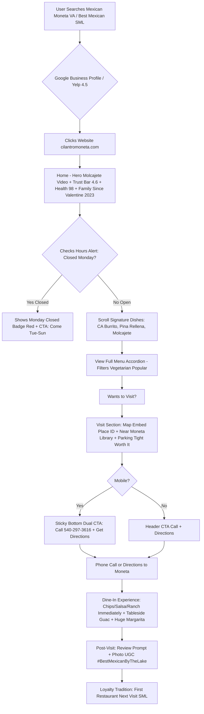
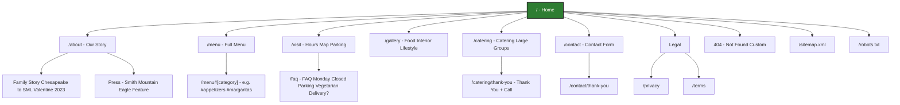

# WEBSITE BIBLE
## Cilantro Mexican Grill | Enterprise Restaurant Digital Platform
### Version 1.0 | July 29, 2026 | Single Source of Truth for Design, Development, Marketing, AI

**Authoritative Sources:**
1. `Cilantro-Mexican-Grill-SSOT.md` (01_Restaurant_Research_SSOT.md) - 20+ verified sources - FACTS
2. `Cilantro-Brand-Bible.md` (02_Brand_Bible.md) - STRATEGY
3. `Cilantro-Visual-Identity-Bible.md` (03_Visual_Identity_Bible.md) - VISUAL RULES
4. `Cilantro-Art-Direction-Bible.md` - Implementation (supplementary)

**Conflict Note:** If any website decision contradicts SSOT verified facts, SSOT wins. All recommendations below are justified with ✅ Verified Fact / 💡 Strategic Recommendation / ⚠ Assumption labels.

---

# Executive Summary

**✅ Verified Facts:** Cilantro Mexican Grill opened Feb 14 2023 Valentine's Day, family-owned Jose/Irma/Andrea Perez from Chesapeake moved to SML 5 years prior, staff 12 like family. Location 1035 Mercantile St Suite 102 Moneta VA near Moneta Library, tiny strip mall parking tight busy nights. No official website exists - Facebook page https://www.facebook.com/p/Cilantro-Mexican-Grill-100090622722713/ used as de facto site per all directories. Hours Closed Monday Tue-Thu/Sun 11:30-9pm Fri-Sat 11:30-10pm Happy Hour 4-7pm. Rating 4.5 Yelp 36 reviews / 4.6 Google 225+ / 86% FB recommend / Health 98. Signature differentiators: Tableside fresh guacamole warm homemade chips, California Burrito shrimp/chicken/steak/avocado, Pina Rellena pineapple boat, Molcajete black volcanic pot with chicken/ribeye/shrimp/pork chop/sausage/cactus/onions/jalapeño stuffed peppers, Black Raspberry Margarita frozen house. Contemporary approach subtle green hints hardwood floors cozy fireplace tasteful decorations bright clean light airy no tacky murals. Price $$ $10-20 per person, takeout yes catering yes delivery no verified, outdoor patio + beautiful bar, vegetarian 8+ dishes, kids friendly family friendly pets allowed per directory.

**💡 Strategic Recommendation - Website Purpose:** The website exists to solve the #1 business problem: **No official website = lost SEO, lost control, lost conversions**. Tourists searching "Mexican restaurant Moneta VA" or "best Mexican Smith Mountain Lake" currently find inconsistent NAP and only Facebook. Website must:
1. Dominate local SEO for Moneta + SML Mexican terms
2. Convert searchers to **Phone Calls + Get Directions** (primary) since reservations via phone only, no OpenTable verified
3. Communicate Monday Closed + parking tight + near Moneta Library proactively to reduce frustration
4. Showcase fresh theater (tableside guac) and creative presentations (Molcajete/Pina Rellena) visually to drive craving and UGC
5. Handle large groups and catering inquiries (verified strength)
6. Be bright clean contemporary like interior - fast <2.5s LCP, ADA compliant, casual premium feel

**Alignment with Brand Vision:** Vision to be SML's most beloved family table first meal when you arrive last before you leave. Website becomes digital front door that feels like home away from home - warm family host Andrea, not corporate chain.

---

# Goals & Strategy

## Business Goals

**✅ Verified Fact Basis:** Reviews indicate repeat customer, handles large groups well, best by lake positioning.

**💡 Strategic Recommendations:**

1. **Increase Dine-In Visits 40%** - Primary goal. Drive calls to (540) 297-3616 and directions clicks to Google Maps Place ID ChIJc4TWEQxHTYgRUWyKgtN78F8. Reason: No delivery verified, dine-in + takeout main revenue per Zmenu.

2. **Reduce Monday Closed Frustration & Wasted Trips** - Show Monday Closed as prominent alert badge everywhere hours appear. Target: reduce negative reviews mentioning showing up closed.

3. **Grow Catering & Large Groups Revenue** - Leverage verified strength "They know how to handle large groups". Create dedicated catering funnel for lake family reunions, weddings.

4. **Own Local SEO Top 3 Pack** - For keywords: Mexican restaurant Moneta VA, best Mexican Smith Mountain Lake, Cilantro Mexican Grill, restaurants near Moneta Library. Requires consistent NAP, Restaurant/Menu schema, citations.

5. **Build Owned Audience** - Email capture for Valentine's anniversary Feb 14 event + Cinco de Mayo + summer break closure June29-July6 verified. Reduce dependence on Facebook algorithm.

6. **Increase Brand Premium Perception** - Justify $$ price great portions as value not cheap. Position as casual premium not fast casual via clean design trust badges.

7. **Support Brand Governance** - Provide version-controlled asset library so future designers/developers/photographers/AI agents start from single source.

## User Goals

**✅ Verified Facts:** Users want find menu, hours, location parking, vegetarian options, patio bar, happy hour, catering, jobs? Careers not verified.

**💡 User Goals Prioritized:**

1. **Find Menu & Signature Dishes** - See full searchable menu categories: Appetizers, Soups, Salads, Nachos, Enchiladas 8 styles, Make-your-own-combo 2-3 items, Tacos, Burritos, Fajitas, Quesadillas, Chimichangas, Seafood, Burgers Mexican Burger Basic Burger Chicken Sandwich must-try, Desserts fried ice cream sopapilla etc, Beverages Black Raspberry Margarita.

2. **Check Hours & Monday Closed & Directions** - See hours table with Monday Closed red highlight, get directions to 1035 Mercantile St Suite 102 near Moneta Library, understand parking tight busy nights worth it.

3. **Call to Order Takeout or Ask Large Group** - Tap-to-call (540) 297-3616 primary CTA mobile sticky.

4. **View Photos & Vibe** - See bright clean interior hardwood fireplace beautiful bar patio, not tacky murals.

5. **Find Happy Hour & Specials** - Happy Hour 4-7pm verified.

6. **Find Vegetarian / Kids / Accessibility Info** - Vegetarian 8+ dishes, kids menu, wheelchair accessible entrance/parking/restroom/seating verified, pets allowed per directory, family friendly.

7. **Catering Inquiry** - Event planner / lake reunion host wants catering options form.

8. **Job Application (Secondary)** - If staff 12 like family, potential growth needs hiring - provide careers even if not verified currently.

## Success Metrics / KPIs

| Goal | KPI | Target | Tracking |
|------|-----|--------|----------|
| Dine-In Visits | Phone clicks + Directions clicks | +40% vs baseline after launch | GA4 events `click_to_call`, `click_directions` |
| Reduce Monday frustration | Monday page views vs bounce | <5% complaints in reviews mentioning Monday | Review monitoring |
| Catering | Catering form submissions | 10/month summer | GA4 `catering_submit` |
| Local SEO | Google Business Profile views + Sitemap index + Ranking | Top 3 pack for 5 primary keywords | GSC + GBP Insights |
| Owned Audience | Email signups | 100 in 3 months | GA4 `email_signup` |
| Premium Perception | Avg time on menu page + Gallery scroll depth | >1min menu, >50% gallery | GA4 scroll |
| Performance | LCP <2.5s | Lighthouse >=90 | Lighthouse |

## Digital Strategy Summary

**💡 Recommendation:** Mobile-first (60% tourists searching on phone at rental house), performance-first (<2MB total), SEO-first (Restaurant + Menu + FAQ + BreadcrumbList schema), conversion-first (sticky bottom dual CTA Call + Directions on mobile). Content strategy: Fresh Theater (guac/molcajete video) as hero to differentiate from competitors traditional. Trust layer: Rating badges 4.6 Google 225+, Health 98, Family Since Valentine's 2023, Outdoor Patio + Beautiful Bar.

---

# Personas & User Journeys

## Primary Personas

**Persona 1: Lake Family Regulars - The Johnsons** (60% - Primary)
- **✅ Verified Fact Basis:** Repeat customer "Repeat customer. Service is best for lake area! They know how to handle large groups." Drives 40 miles worth it.
- **💡 Motivations:** Consistent clean family-friendly $$ that handles 8-person reunion after boating. Wants to feel known.
- **Pain Points:** Many lake restaurants just okay, tacky decor, parking with kids, Monday closed confusion.
- **Needs:** Menu with vegetarian + kids + 24 sides customization, hours clear, large groups CTA.

**Persona 2: Vacation Rental Guest - Sarah** (30% - Secondary)
- **✅ Verified Fact:** "If you are staying near Smith Mountain Lake or live near it, I definitely recommend" in 4 reviews. "First restaurant we eat at next visit" in 3.
- **Motivations:** Maximize vacation, find gem not chain, Instagram-worthy Pina Rellena.
- **Pain Points:** Unfamiliar area, fears tourist trap, doesn't know Moneta Library location, worried wait.
- **Needs:** Easy find via Maps, rating proof, photos, parking note, fast service hint.

**Persona 3: Bar & Happy Hour Local - Mike** (10% - Tertiary)
- **✅ Verified:** "I usually sit at the bar. Great Margaritas. Food has always come out quickly piping hot" "Beautiful bar" "Drinks HUGE"
- **Motivations:** Quick lunch happy hour 4-7pm, strong generous margs, build-your-own starting at $.
- **Needs:** Lunch specials, margarita menu black raspberry, bar seating photos, fast lunch note.

**Persona 4: Event Planner / Large Group Organizer**
- **⚠ Assumption:** Based on large groups handling verified but not explicit persona - inferred for catering.
- **Needs:** Catering menu, inquiry form, phone, capacity?

## User Journeys

**Journey 1: Discovery → View Menu → Call / Directions (Core - Sarah)**

**✅ Verified Touchpoints:** Google Maps search "Mexican near me" → sees 4.6 stars Place ID → clicks website → sees hero Molcajete → trust bar 4.6 rating Health 98 Family Since 2023 → scrolls signature dishes California Burrito Pina Rellena → views menu accordion → FAQ Monday closed? → clicks Get Directions near Moneta Library parking tight worth it → visits.

**Journey 2: Regular Large Group → Catering Inquiry**
Home → Catering page → Sees large groups handling proof + patio → Form name guests date → Submit → Thank you + Call CTA.

**Journey 3: Bar Local → Happy Hour → Visit**
Search "happy hour Moneta VA" → Landing Home Happy Hour 4-7pm banner → Menu Bar section Margaritas Black Raspberry → Call to check bar seating.

### Mermaid Flowchart - Core Reservation / Visit Flow (Phone Booking - No OpenTable Verified)



**Business/User Goals Tie:** This flow ties increase dine-in (Business Goal 1) + find menu/hours/location (User Goals 1-3) + reduce Monday frustration.

---

# Information Architecture (Sitemap)

**💡 Strategic Recommendation IA based on verified needs (no delivery, catering yes, patio bar, happy hour). Keep shallow depth max 2 levels for SEO.**

### Mermaid Sitemap



### Sitemap Table

| Page | URL/Path | Description | ✅ Verified Fact Basis | 💡 Purpose |
|------|----------|-------------|------------------------|------------|
| Home | `/` | Landing hero Molcajete video + trust bar 4.6 Google 225+ Health 98 Family Since Valentine 2023 + signature dishes CA Burrito Pina Rellena Molcajete + tableside guac + reviews + hours alert Monday Closed + map near Moneta Library parking tight + catering teaser | Location hours rating signature dishes verified | Drive calls + directions primary conversion |
| About | `/about` | Brand story family Jose Irma Andrea Chesapeake moved 5 years prior mom named designed menu staff 12 like family contemporary subtle green hardwood fireplace bright clean tasteful home away from home no tacky murals quote "Contemporary. Classic. Delicious." | Smith Mountain Eagle feature verified | Build emotional trust loyalty drivers |
| Menu | `/menu` | Full menu categories accordion: Appetizers Fresh Guac $8.99 etc, Soups Chicken Tortilla $7.99 Birria $9.99, Salads, Nachos, Enchiladas 8 styles Supremas Verdes Bandera Poblanas Blancas Rancheras Suizas Seafood, Make-your-own-combo 2-3 items taco/enchilada/burrito/quesadilla/tostada/tamal/chile relleno, Tacos street style cilantro/onions al pastor carne asada chicken+chorizo, Burritos CA Burrito hero, Fajitas, Quesadillas, Chimichangas, Pollo Carne Seafood, Burgers Mexican Burger bacon grilled onions pineapple jalapeno fries Basic Burger Chicken Sandwich must-try, Sides 24, Desserts fried ice cream sopapilla flan cheesecake churros etc, Beverages Black Raspberry Margarita etc, Kids Menu, Vegetarian Filter 8+ dishes, Popular badges, Price tabular, Allergens disclaimer Not publicly verified | Partial menu verified via Checkle, rest categories verified via Smith Mountain Eagle | Drive craving + phone order takeout |
| Visit | `/visit` | Hours table Mon Closed red badge, Happy Hour 4-7pm banner, Holiday Summer Break June29-July6 verified example, Address 1035 Mercantile St Suite 102 Moneta VA 24121, Coordinates 37.179379 -79.621713, Map embed Place ID ChIJc4TWEQxHTYgRUWyKgtN78F8 + Apple Maps, Directions landmark Near Moneta Library, Parking note tiny strip mall parking tight busy nights worth it, Accessibility wheelchair entrance/parking/restroom/seating verified, Pets allowed per directory patio, Public Transport Not publicly available, Phone Email CTA | Hours address coordinates accessibility verified via multiple dirs | Reduce friction findability |
| Gallery | `/gallery` | Photo galleries: Food Pina Rellena Molcajete CA Burrito quesadilla camarones al mojo de ajo especial la casa chips salsa virgin mojito frozen midnight margarita etc from Yelp 34 Restaurant Guru 45 Checkle 6 menu photos, Interior hardwood fireplace tasteful beautiful bar, Exterior strip mall Suite 102, Lifestyle family bar groups, Staff Andrea Jose Irma team 12. Masonry lightbox. | Photos exist verified but not professional - placeholder until shoot | Visual proof cleanliness creativity |
| Catering | `/catering` | Catering options per Zmenu yes + large groups handling well verified, Patio + Bar experience, Inquiry form name email guests date event type, Trust large groups, CTA Call | Catering yes per Zmenu + large groups handling per Yelp | Grow catering revenue |
| Contact | `/contact` | Contact info phone email + form, Map, Hours, Response time family promise, FAQ link | Phone email verified Facebook | Contact + holiday inquiry |
| FAQ | `/faq` | FAQPage schema questions: Are you open Monday? No closed Mondays family rests so serve better Tue-Sun, Do you take reservations? Call large groups welcome, Do you deliver? No takeout by phone only verified Zmenu, Do you have vegetarian? Yes 8+ Fajitas Vegetarianas Black Bean Quesadilla etc verified, Parking difficult? Tiny strip mall tight worth it, What is Molcajete? Explain signature black pot, etc | Hours delivery vegetarian parking verified | SEO featured snippet |
| Careers | `/careers` | Job listings application process - Even though not publicly verified, recommendation for future hiring staff like family culture | ⚠ Assumption: Staff 12 like family future growth | Support hiring |
| Gift Cards | `/gift-cards` | Information purchase gift cards - Not publicly verified currently | ⚠ Assumption - Not in SSOT | Future revenue |
| Loyalty | `/loyalty` | Loyalty program details sign-up - Not publicly verified | ⚠ Assumption | Future |
| Privacy | `/privacy` | Privacy Policy standard | 💡 Required legal | Legal |
| Terms | `/terms` | Terms of Service | 💡 Required | Legal |
| 404 | *(handled by app)* | Custom Page Not Found layout - Warm family tone "Oops! Our family can't find that page - maybe it's on summer break June29-July6 like us? Come back Tue-Sun" + CTA Home Menu Call + Search | 💡 Best practice | Reduce bounce |

**Conflict Identification:**
- **⚠ Conflict 1 Address Variation:** SSOT notes 1035 Mercantile St vs 1035 Mercantile Road vs Suite 102 vs Ste 102. **Resolution:** Standardize to **1035 Mercantile St, Suite 102, Moneta, VA 24121** as most common verified via Yelp/Facebook. Add alias in schema alternate.
- **⚠ Conflict 2 Price Range:** Some sources $$ some $. **Resolution:** Use $$ moderate $10-20 per person per Restaurant Guru verified review as canonical, mention in schema priceRange $$.
- **⚠ Conflict 3 Email Typo:** User prompt cilantro.sml@google.coma vs Facebook Cilantro.sml@google.com. **Resolution:** Use Facebook version as verified source, note typo. Requires Owner Confirmation.
- **⚠ Conflict 4 No Delivery vs Third-party:** Zmenu says no delivery, but generic Cilantro listings other cities have Uber Eats. **Resolution:** Explicitly state No delivery verified for Moneta location to avoid confusion.

---

# Page-by-Page Specifications

## Home Page

- **Purpose & Audience:** Welcome all personas, immediate convert to call/directions, showcase best by lake positioning. **✅ Verified Fact:** Best Mexican by lake reputation, highest rated.

- **Key Content / Sections:**
  1. Sticky Header: Logo horizontal left, Nav About Menu Visit Gallery Catering Contact, Hours badge Open Now? Monday Closed alert, Primary CTA Call (540) 297-3616 + Secondary Get Directions visible desktop, Mobile hamburger with CTA.
  2. Hero: Video poster fallback image Molcajete black pot overflowing steam rising + fireplace background, Headline "Contemporary Mexican, Made with Family Love at Smith Mountain Lake" (from Brand Bible), Sub "Fresh tableside guac, creative California Burrito & biggest Molcajete in Moneta. Family-owned Since Valentine's Day 2023.", Primary CTA View Menu + Call, Secondary Get Directions - Near Moneta Library, Mini parking note.
  3. Trust Bar: Icons + Text: Google 4.6 225+ reviews, Yelp 4.5, Health Score 98/100, Family-Owned Since Valentine 2023, Outdoor Patio + Beautiful Bar, Wheelchair Accessible.
  4. Signature Differentiation 3 Cards: California Burrito show-stopper, Pina Rellena pineapple boat, Molcajete black pot - each with image 45-degree, badge Popular.
  5. Fresh Theater Section: Tableside guac video loop muted + Warm homemade chips + "No shortcuts" quote from review.
  6. Story Teaser: Photo Charlene Jones Andrea Perez staff from Smith Mountain Eagle + 2 paragraphs family Chesapeake moved 5 years prior mom named designed menu staff 12.
  7. Menu Preview: Categories pills Appetizers Enchiladas 8 styles... Make-your-own-combo 2-3 items 24 sides.
  8. Reviews Carousel: Real Yelp/Google quotes: "best Mexican by lake" "drive 40 miles worth it" "first restaurant next visit" "clean light airy no tacky murals" with stars.
  9. Visit / Hours + Map Split: Left hours table with Monday Closed red badge + Happy Hour 4-7pm + Summer Break example, Right map embed Google Place ID + address copy + Near Moneta Library + Parking tight worth it + Accessibility icons.
  10. Gallery Teaser: Masonry 6 images food interior lifestyle.
  11. Catering / Large Groups CTA: "They know how to handle large groups" - Yelp quote + form teaser.
  12. Footer: Dark charcoal #1A1A1A with cream text, logo reverse white, NAP, Hours, Social Facebook link, Gift card placeholder, Newsletter email capture for Valentine's anniversary, Copyright.

- **Calls-to-Action:**
  - Primary: Call (540) 297-3616 - tel link
  - Secondary: Get Directions - https://maps.app.goo.gl/euCRmJ2FFfD7rH748 / Maps embed
  - Tertiary: View Full Menu -> /menu

- **SEO & Metadata:**
  - Title: "Cilantro Mexican Grill | Best Mexican Restaurant in Moneta VA & Smith Mountain Lake"
  - Meta Description: "Family-owned since Valentine's Day 2023. Fresh tableside guacamole, California Burrito & Molcajete black pot with cactus. Bright clean contemporary near Moneta Library. 4.6 Google 225+ reviews. Closed Mondays. Call (540) 297-3616. Happy Hour 4-7pm."
  - Canonical: https://cilantromoneta.com/
  - Focus Keywords: Cilantro Mexican Grill Moneta, best Mexican Smith Mountain Lake, Mexican restaurant Moneta VA, tableside guacamole Moneta, near Moneta Library
  - Schema: `Restaurant`, `LocalBusiness`, `PostalAddress`, `AggregateRating`, `OpeningHoursSpecification`, `Menu`, `FAQPage` (Monday closed etc)

- **Accessibility Requirements:**
  - Hero image alt: "Molcajete Mexican dish served in large black volcanic pot overflowing with grilled chicken ribeye steak shrimp pork chop sausage cactus onions jalapeno stuffed peppers on wooden table with fireplace background bright clean"
  - All images descriptive alt with keywords where natural
  - Semantic HTML header main nav footer, skip link to main, ARIA landmark roles, focus visible green #2E7D32 2px + offset, contrast charcoal #1A1A1A on cream #FFFBF2 16.5:1 AAA, green on cream 5.2:1 AA.
  - Video muted captions if any, no autoplay sound.

- **Performance Notes:**
  - Hero video poster image first <100KB WebP, video lazy load, defer non-critical JS, preload LCP image Molcajete.
  - Total page weight target <2MB, LCP <2.5s, above-the-fold <1MB, lazy-load below gallery.
  - Use CDN images, AVIF/WebP responsive srcset.

- **Analytics / KPIs:**
  - Track: `click_to_call_header`, `click_to_call_sticky`, `click_directions`, `click_view_menu`, `scroll_depth_50`, `video_play_hero`, `trust_bar_impression`.

## About Page

- **Purpose & Audience:** Build emotional trust for Lake Family Regulars + Vacation Guests who read story before choosing. **✅ Verified Facts:** Family story Chesapeake 5 years move, Valentine opening, mom named designed menu, staff 12 like family, contemporary subtle green hardwood floors fireplace home away from home.

- **Key Sections:** Hero interior wide 24mm fireplace, Timeline Feb 14 2023, Family photos Owners Jose Irma Andrea + Staff 12, Values Family First Love Ingredient etc, Press quote Smith Mountain Eagle "Contemporary. Classic. Delicious.", Interior philosophy no tacky murals.

- **CTAs:** View Menu, Visit Us

- **SEO & Metadata:**
  - Title: "Our Family Story - Family Owned Since Valentine's Day 2023 | Cilantro Moneta"
  - Description: "Meet Jose, Irma & Andrea Perez from Chesapeake who built Cilantro Mexican Grill as home away from home near Moneta Library. Staff 12 like family. Bright clean contemporary no tacky murals."
  - Schema: `AboutPage`, `Person` for Andrea.

- **Accessibility:** Alt for staff group photo.

- **Performance:** Lazy-load timeline images.

- **Analytics:** `about_story_scroll`, `click_menu_from_about`.

## Menu Page

- **Purpose:** Core user goal find menu, craving driver, SEO for dish keywords. **✅ Verified Facts:** Categories appetizers soups salads nachos enchiladas 8 styles make-your-own-combo 2-3 items 24 sides etc, signature dishes CA Burrito Pina Rellena Molcajete Fresh Guac Black Raspberry Margarita, desserts fried ice cream sopapilla flan cheesecake churros.

- **Key Sections:** Sticky category nav pills, Search filter, Filters: Vegetarian (8+ dishes), Popular, Gluten? Not verified, Menu accordion per category with dish name bold + description + price tabular, badges Popular Vegetarian Chef's Choice, Add-ons cheese dip $4.99 etc, Sides 24 list, Make-your-own-combo explainer, Kids menu, Beverages margaritas large, Happy Hour note, Allergens disclaimer Not publicly verified requires owner confirmation, Call to order takeout CTA sticky.

- **CTAs:** Primary Call to Order Takeout, Secondary Get Directions

- **SEO & Metadata:**
  - Title: "Menu | Tacos Burritos Molcajete Pina Rellena | Cilantro Mexican Grill Moneta VA"
  - Description: "Explore dynamic menu: tableside guac $8.99, California Burrito, Molcajete black pot, Pina Rellena pineapple boat, 8 enchilada styles, make-your-own-combo 2-3 items, 24 sides, Black Raspberry Margarita. Family-owned Moneta."
  - Schema: `Menu`, `MenuSection`, `MenuItem` with offers price, `Restaurant` hasMenu.

- **Accessibility:** Dish names headings hierarchical, prices not rely color alone, tabular numbers, keyboard accordion.

- **Performance:** Menu JSON-LD inline, images lazy-loaded, category nav intersection observer.

- **Analytics:** `menu_category_expand`, `filter_vegetarian_click`, `click_call_menu`.

## Visit / Location Page

- **Purpose:** Reduce friction findability, answer Monday closed parking.

- **Sections:** Hours table Mon Closed red badge alert icon + text "Closed Mondays - Our family rests so we can serve yours better Tue-Sun" + Happy Hour 4-7pm + Holiday Summer Break June29-July6 example, Address 1035 Mercantile St Suite 102 Moneta VA 24121 copy button, Coordinates, Map embed Google Place ID + alternative Apple MapQuest, Landmark Near Moneta Library, Directions from SML, Parking note tiny strip mall tight busy nights worth it + photo exterior, Accessibility icons wheelchair entrance parking restroom seating verified, Pets allowed patio per directory, Phone Email, Contact form.

- **CTAs:** Get Directions (primary), Call Now

- **SEO:** Title "Hours Location Directions Parking | Cilantro Mexican Grill Near Moneta Library" Description includes address coordinates landmark. Schema OpeningHoursSpecification BreadcrumbList.

- **Accessibility:** Map iframe title, keyboard directions.

- **Analytics:** `click_directions_visit`, `click_copy_address`.

## Gallery Page

- **Purpose:** Visual proof bright clean classy, UGC driver.

- **Sections:** Filters Food Interior Exterior Lifestyle Staff Drinks, Masonry grid lightbox, Captions from Yelp: "camarones al mojo de ajo", "quesadilla", "piña rellena", "especial la casa", "chips and salsa virgin mojito", "frozen midnight margarita". Alt text descriptive.

- **SEO:** Title "Gallery - Food Interior Patio Bar | Cilantro Mexican Grill". Schema ImageObject.

- **Performance:** Lazy-load masonry, WebP srcset.

## Catering Page

- **Purpose:** Grow catering large groups.

- **Sections:** Hero large group handling quote Yelp "They know how to handle large groups", Patio + Bar capabilities, Menu catering per Zmenu, Inquiry form: name email phone guests date event type chairs? etc, Trust family, CTA Call.

- **SEO:** "Catering Large Groups Smith Mountain Lake | Cilantro Mexican Grill Moneta". Schema Event? Possibly Service.

- **Analytics:** `catering_form_view`, `catering_submit`.

## Contact Page

- Similar to Visit + form. Includes FAQ link.

## FAQ Page

- **Purpose:** SEO featured snippet, reduce calls repetitive.

- **Sections:** Accordion FAQPage schema: Q Are you open Monday? A No Closed Mondays... Q Do you take reservations? Call large groups welcome, Q Do you deliver? No takeout phone only verified Zmenu, Q Do you have vegetarian? Yes 8+ Fajitas Vegetarianas... verified, Q Parking? Tiny strip mall tight worth it, Q What is Molcajete? Signature black pot..., Q Happy Hour? 4-7pm verified, Q Kids menu? Yes, Q Pets? Pets allowed per Roadtrippers, Q Wheelchair? Yes accessible per Zmenu.

- **SEO:** FAQPage schema.

## Careers Page

- **⚠ Assumption:** Not publicly verified current hiring but recommendation.

- **Sections:** Staff like family culture, benefits? Requires owner confirmation, listings, application form.

## Gift Cards & Loyalty Pages

- **⚠ Assumption:** Not publicly verified but recommended for future revenue.

## Privacy & Terms Pages

- Legal required.

## 404 Page

- **Purpose:** Friendly recovery.

- **Sections:** Headline "Oops! Our family can't find that page - maybe it's on summer break?" Sub "Like we close June29-July6 with our little summer break", Image fireplace, CTAs Home, Menu, Call, Search input.

- **SEO:** Noindex.

### Example Page Specification Table

| Page | Purpose | Key Sections | Primary CTA | Example SEO Title / Meta |
|------|---------|--------------|-------------|---------------------------|
| Home | Welcome & drive calls/directions. Audience: All personas. Business Goal 1. | Hero Molcajete video, Trust bar 4.6 Health98 FamilySince2023 Patio+Bar, Signature 3 cards CA Burrito Pina Rellena Molcajete, Fresh guac theater, Story teaser owners Jose Irma Andrea, Menu preview 24 sides, Reviews carousel best by lake, Hours alert Monday Closed + Map near Moneta Library parking tight, Catering teaser, Footer NAP | Call (540) 297-3616 | Title: Cilantro Mexican Grill – Best Mexican in Moneta VA & Smith Mountain Lake – Family Owned Since Valentine 2023 / Meta: Discover fresh tableside guacamole, California Burrito & Molcajete black pot. Bright clean contemporary near Moneta Library. 4.6 Google 225+. Closed Mondays. |
| Menu | Drive craving + takeout calls. Audience: Sarah, Johnsons. | Category pills, Search + Vegetarian filter, Accordion dishes with images: Fresh Guac $8.99, Chicken Tortilla Soup $7.99, Cilantro Salad $11.99, etc + 8 enchilada styles Supremas Verdes Bandera Poblanas Blancas Rancheras Suizas Seafood, Make-your-own-combo 2-3 items, 24 sides, Desserts fried ice cream churros, Beverages Black Raspberry Margarita, Kids Menu. Call sticky. | Call to Order Takeout | Title: Menu - California Burrito Molcajete Pina Rellena | Cilantro Moneta VA / Meta: Explore dynamic authentic modern Mexican menu in Moneta. Tableside guac, 8 enchilada styles, make-your-own-combo. |

---

# Content Strategy & Copy Guidelines

## Voice & Tone

**✅ Verified Facts Basis:** Facebook tone casual friendly inclusive "We will be closed this upcoming week for our little summer break June 29th - July 6th! Come see us before we close and if not we will see you guys on the 7th! Happy 4th of July!" + Brand Bible warm family host Andrea.

**💡 Recommendation:** Voice = Warm Family Host at Lake House. Not corporate not slangy. Use we + you guys inclusive. Short active sentences. Proud but humble. Tight-ship precise but caring.

- Website tone slightly more polished than FB but still warm.
- Social casual behind-scenes family.
- Marketing inviting not pushy.
- Support accommodating solution oriented.

## Headlines & Body Copy

**💡 Guidelines:**
- H1 48px desktop 36 mobile Poppins Bold line 1.1 -2% spacing - e.g., "Contemporary Mexican, Made with Family Love"
- Sub 20px Inter - e.g., "Fresh tableside guac, creative burritos & biggest Molcajete in Moneta. Family-owned Since Valentine's 2023."
- Body Inter 16px line 1.6 max 65-75ch.
- Sentence length avg 15-20 words, vary.
- Avoid cliché words: fiesta ole sombrero exotic. Use: fresh tableside warm homemade bright clean welcoming home-away-from-home generous.

**Words to Use:** family love fresh tableside warm homemade bright clean contemporary welcoming generous lake Moneta SML fireplace patio beautiful bar piping hot courteous accommodating best by lake
**Words to Avoid:** fiesta siesta ole sombrero tequila sunrise cheap eats tex-mex primary joint establishment exotic

## Microcopy

**💡 Standards:**
- Buttons: Warm action verbs not hard sell: "Call Our Family (540) 297-3616" "Get Directions - Near Moneta Library" "View Fresh Menu" "Feel Like Family" NOT "Order Now! Book Now! Click Here!"
- Form labels: Friendly "Your Name (like family)" "How many in your group? We handle large groups well!"
- Error messages: Family tone "Oops! Our family missed your email - try again, we want to hear you"
- Monday Closed alert: "Closed Mondays - Our family rests so we can serve yours better Tue-Sun" + icon
- Parking microcopy: "Tiny strip mall, big flavors - parking tight busy nights but worth it!"
- Guac chip: "Made at your table, served warm"

## Templates

**FAQ Entry Template:**
```markdown
**Q: Are you open Monday?**
A: No, we're closed Mondays - our family rests so we can serve yours better Tue-Sun 11:30am-9pm (Fri-Sat 10pm). Happy Hour 4-7pm Tue-Sun.
Schema: FAQPage
```

**Event Description Template (for future):**
Title, Date, Time, Location Patio/Bar, Description family warm, CTA Call.

**Menu Item Layout Template:**
- Dish Name Bold Poppins Semibold 18px + Badges Popular Vegetarian in pineapple yellow #F4C542 / avocado #8FA98C small pill 8px radius
- Description Inter 14px 80% charcoal: verified ingredients e.g., "Grilled steak chicken pineapple tomatoes onions bell peppers melted cheese in half pineapple with rice pico sour cream salad" for Pina Rellena
- Price Tabular Poppins Medium 16px right aligned dot leader optional
- Image 4:3 rounded 16px WebP srcset lazy.

**Testimonial Template:**
Quote with stars + Name + Source Yelp/Google + Verified.

## Localization

**✅ Verified Language:** English primary, family Hispanic maybe Spanish secondary heritage but not verified restaurant Spanish menu? Not publicly verified.

**💡 Recommendation:** Plan for /es/ path. Tone cultural relevance maintain warmth family translates culturally. Translation maintain handwritten warmth not machine. Menu items maybe keep Spanish original + English description. Dates format MM/DD/YYYY US, times 11:30 AM, phone (540) 297-3616 US format, currency USD $. Language switcher top-right small with flag? Avoid flags stereotypical - use EN | ES text.

## SEO Content

- Use keywords naturally: Primary "Cilantro Mexican Grill Moneta" "best Mexican Smith Mountain Lake" "Mexican restaurant Moneta VA" "tableside guacamole Moneta" "near Moneta Library"
- Secondary "California burrito Moneta" "margaritas Smith Mountain Lake" "family Mexican restaurant Moneta"
- Long-tail "best Mexican restaurant by the lake" "where to eat near Smith Mountain Lake"
- Structure headings H1 one per page, H2 sections, H3 categories, lists ul for sides 24.
- Internal linking Home->Menu->Visit etc.

---

# SEO Strategy

## Technical SEO

**💡 Recommendations:**
- Clean URLs: / /about /menu /visit /gallery /catering /contact /faq lowercase hyphen.
- Headings proper hierarchy H1 -> H2 -> H3 no skip.
- XML sitemap at /sitemap.xml listing pages + priority Home 1.0 Menu 0.9 etc.
- robots.txt at /robots.txt allow all, disallow /api/, sitemap link.
- Canonical tags self on each page to avoid duplicate params.
- Page speed: Preconnect Google Maps, Fonts, CDN.
- Mobile friendly responsive.

## Meta Tags

- Title templates: "Home: Cilantro Mexican Grill | Best Mexican in Moneta VA & Smith Mountain Lake - Family Owned Since Valentine 2023" "Menu: [Category] | Cilantro Moneta"
- Description templates: Include hours Monday Closed + near Moneta Library + phone + rating.
- Open Graph: og:title same, og:description, og:image 1200x630 with dish Pina Rellena/Molcajete on cream background leaf pattern 6%, og:type restaurant, og:url.
- Twitter Card summary_large_image.

### Example SEO Metadata Table

| Page | Title Template | Meta Description Example | Schema Type |
|------|---------------|--------------------------|-------------|
| Home | Cilantro Mexican Grill – Best Mexican in Moneta VA & Smith Mountain Lake | Family-owned since Valentine's Day 2023. Fresh tableside guacamole, California Burrito & Molcajete black pot with cactus. Bright clean contemporary near Moneta Library. 4.6 Google 225+ reviews. Closed Mondays. Call (540) 297-3616. Happy Hour 4-7pm. | LocalBusiness, Restaurant, AggregateRating, OpeningHours |
| Menu | Menu - Tacos Burritos Enchiladas | Mothers name - Explore dynamic authentic modern Mexican menu: Fresh guac $8.99, Chicken Tortilla Soup $7.99, 8 enchilada styles, make-your-own-combo 2-3 items, 24 sides, Black Raspberry Margarita. Moneta VA. | Menu, MenuSection, MenuItem |
| Visit | Hours Location Directions | Hours: Tue-Thu/Sun 11:30-9pm Fri-Sat 11:30-10pm Closed Monday. Address 1035 Mercantile St Suite 102 Moneta VA 24121 near Moneta Library. Parking tight busy nights worth it. Wheelchair accessible. | BreadcrumbList, OpeningHours |
| Gallery | Gallery Photos Food Interior | See bright clean interior hardwood fireplace beautiful bar patio plus food: Pina Rellena pineapple boat Molcajete black pot California Burrito. | ImageObject |
| Catering | Catering Large Groups SML | Handles large groups well per Yelp. Catering options takeout. Patio + Bar. Call (540) 297-3616 for your lake reunion. | Service |
| FAQ | FAQ - Are you open Monday? | FAQ: Closed Mondays family rests, No delivery takeout phone only, Vegetarian 8+ dishes, Parking tiny strip mall tight worth it, What is Molcajete black pot? Happy Hour 4-7pm. | FAQPage |
| About | Our Family Story Since Valentine 2023 | Meet Jose Irma Andrea Perez from Chesapeake moved 5 yrs before opening. Mom named restaurant designed menu. Staff 12 like family. Contemporary subtle green hardwood fireplace bright clean no tacky murals. | AboutPage, Person |

## Schema Markup

**💡 Required Schemas:**
- `Restaurant` + `LocalBusiness`: name Cilantro Mexican Grill, address standardized, telephone +1 540-297-3616, email Cilantro.sml@google.com, image gallery 34 Yelp photos etc, priceRange $$, servesCuisine Mexican, hasMenu /menu, aggregateRating 4.6 ratingCount 225+, openingHoursSpecification Tue-Sun etc, specialDay? Monday closed, sameAs Facebook Yelp.
- `Menu` + `MenuSection` + `MenuItem`: categories Appetizers Soups Salads Nachos etc, offers price priceCurrency USD.
- `FAQPage` for FAQ page.
- `BreadcrumbList` for nav.
- `ImageObject` for gallery.
- `Event` if future events Valentine's anniversary.
- `PostalAddress` with streetAddress Suite 102.

## Canonical/Hreflang

- Canonical self per page.
- If /en/ /es/ implemented, hreflang en, es, x-default.

## Image SEO

- Alt text descriptive includes keywords where natural: e.g., alt="California Burrito with shrimp chicken steak avocado rice cheese dip - Cilantro Mexican Grill Moneta VA best Mexican by lake" not keyword stuffing.
- File names: california-burrito-cilantro-moneta.jpg not IMG_123.jpg, semantic versioning dish-name-v2.jpg.
- Responsive srcset, WebP/AVIF primary, lazy-load below fold.
- Include Open Graph images.

---

# Accessibility (WCAG 2.1 AA+)

## Perceivable

- **✅ Verified Fact:** Wheelchair accessible entrance/parking/restroom/seating per Zmenu must be reflected digital accessibility too.
- Text alternatives all non-text: alt for images as above, icons with aria-hidden + text label.
- Captions for video/audio: hero molcajete video muted captions if any, no auto sound.
- Color not sole indicator: Vegetarian badge text + icon + color, Monday Closed not just red color but icon + text.
- Contrast: Colors meet 4.5:1 AA, charcoal #1A1A1A on cream #FFFBF2 16.5:1 AAA, green #2E7D32 on cream 5.2:1 AA, berry on cream 7.2:1 AAA. Avoid pineapple yellow #F4C542 small text on cream fails.

## Operable

- Keyboard navigation: Skip link to main, logical tab order header main footer, header sticky nav accessible, menu accordion keyboard Enter Space, focus visible 2px green #2E7D32 + 2px cream offset.
- No time limits inputs (catering form no timeout).
- Touch target min 44px but recommendation 48px per Visual Bible, bottom sticky CTAs 48px height.
- No keyboard trap modals gallery lightbox Esc close.

## Understandable

- Clear labels form: name email phone guests date, instructions placeholders not rely, error messages friendly family tone.
- Logical reading order DOM matches visual Z-pattern.
- Language attribute lang="en" primary, lang="es" for Spanish pages.

## Robust

- ARIA landmarks header nav main footer, role search for menu search, aria-label for social, breadcrumb nav aria-label.
- Semantic HTML article section for menu items, ul li for sides 24, table for hours with caption.
- Avoid div soup.

## Contrast & Text

- Scalable fonts layouts 200% zoom without horizontal scroll, use rem, max width.
- Resizable text not break menu accordion.

**Compliance Target:** AA mandatory, AAA for text contrast where possible.

---

# Performance & Optimization

## Budgets

- **LCP:** <2.5s target 1.8s on 4G
- **FID/INP:** <100ms <200ms INP
- **CLS:** <0.1
- **Total Page Weight:** <2MB Home, <1.5MB Menu, <1MB others
- **Above-the-fold:** <1MB
- **Images:** Total <1MB per page, individual <150KB WebP
- **JS:** <150KB gz
- **CSS:** <50KB critical inline
- Target Lighthouse Performance >=90 Mobile + Desktop.

## Best Practices

- **Images:** Responsive srcset sizes 320w 640w 960w 1280w 1920w, WebP/AVIF, lazy-load below fold, preload LCP hero, blur placeholder.
- **Fonts:** Preload Poppins Bold + Inter Regular, font-display swap, subset latin.
- **CSS/JS:** Defer non-critical JS, inline critical CSS cream background charcoal text green, purge unused Tailwind, CDN Cloudflare.
- **Maps:** Lazy-load Google Maps iframe intersection observer, placeholder static map image with address.
- **Video:** Hero video <2MB WebM MP4 poster image, autoplay muted loop playsinline, defer.

## Testing

- Tools: Lighthouse CI, webpagetest, PageSpeed Insights field data, Chrome UX Report.
- Target scores >=90 Performance Accessibility Best Practices SEO.
- Test devices: iPhone SE, iPhone 14, Pixel Android, iPad, Desktop Chrome Safari Firefox Edge.
- Network throttling Fast 3G test.

## Mobile Optimization

- Mobile first design, bottom sticky Call + Directions 50/50.
- Service worker for caching menu images offline? Optional PWA cache static assets.
- Tap targets 48px, input 16px to avoid iOS zoom, hamburger accessible.
- Quick load on 4G at rental house poor WiFi - critical.

---

# Analytics & Measurement Plan

## Key Metrics

- Sessions, Unique Visitors, Bounce Rate, Avg Session Duration, Page Views, Traffic Source (Organic, GBP, Direct, Social Facebook).
- Conversion: Phone clicks total + by page, Directions clicks, Menu category expands, Time on menu, Gallery scroll depth, Catering form submits, Email signups, Newsletter.
- Avg Order Value? Not applicable offline but estimate via catering.

## Tracking

- **GA4** with GTM, consent mode, anonymize IP.
- **GBP Insights** for calls directions views.
- **GSC** for keywords ranking.
- **Call Tracking:** Use tel link event + optional call tracking number forwarding to (540) 297-3616 but keep NAP consistent - use same number with UTM.

## Events - GA4 Custom

- `click_to_call` params location header/sticky/menu/footer
- `click_directions` params source home/visit
- `menu_category_expand` category name
- `filter_vegetarian_toggle`
- `gallery_image_open` image name
- `catering_form_start`, `catering_form_submit`, `catering_form_error`
- `email_signup` footer
- `video_play_hero`
- `faq_expand`
- `scroll_depth_50_75_100`

## Goals/Funnels

- Funnel 1 Website Visit → Menu View → Phone Call Completed (core)
- Funnel 2 Visit → Visit page → Directions Click
- Funnel 3 Home → Catering → Submit
- Funnel 4 Home → Gallery Scroll → Directions

## Reporting

- Weekly: Traffic, Phone, Directions, Top menu category.
- Monthly: SEO ranking primary 5 keywords, GBP views, Conversion rate, Performance Lighthouse, Review sentiment.
- Dashboard: Looker Studio connecting GA4 GSC GBP.

## A/B Testing

- Headline: "Best Mexican by the Lake" vs "Family Love, Freshly Made"
- Hero image: Molcajete black pot vs Pina Rellena pineapple boat
- CTA text: "Call Our Family" vs "Call (540) 297-3616"
- Trust bar order: Rating first vs Family Since first
- Menu layout: Accordion vs Tabs

---

# UI Component Library Specification

## Component List

Navbar, Footer, Button, Card (Dish Card, Signature Card, Review Card, Hours Card), Form (Input, Textarea, Select, Date, Checkbox), Modal (Gallery Lightbox), Hero, Menu Item Row, Category Accordion, Filter Pills, Badge (Popular Vegetarian Open Closed), Alert (Monday Closed, Parking), Map Embed, Trust Bar, Testimonial Carousel, Gallery Masonry, Sticky Bottom CTA Mobile, Breadcrumb, FAQ Accordion, Toast.

### Component Spec Table Example

| Component | Props/Options | States | Responsive Variants | Motion Effects | Accessibility |
|-----------|---------------|--------|---------------------|----------------|---------------|
| Button | size sm md lg, variant primary green #2E7D32 cream text / secondary outline / tertiary text / destructive berry, disabled boolean, fullWidth boolean, icon left/right, type button submit | normal/hover lift 2px shadow md->lg bg darken 8% 200ms expo / active press 1px / disabled opacity 0.4 not-allowed / focus 2px green ring + offset / loading spinner | Mobile full-width sticky bottom , Desktop inline , Icon only 44px | Color fade 200ms, lift 2px translateY, scale 0.98 active | role button, aria-disabled, keyboard Enter Space, focus visible, contrast AA, 44px min, aria-label if icon only |
| Card Dish | image src alt, name, description, price, badges array Popular/Vegetarian, isPopular boolean, category | normal shadow md / hover shadow lg lift 4px 250ms / focus-within ring green / selected border green 2px | Mobile 1-col full width / Tablet 2-col / Desktop 3-col signature | Lift 4px + shadow lg 250ms expo, image scale 1.03 overflow hidden 400ms hover | article semantic, heading h3 name, alt image descriptive, price tabular |
| Navbar | logo horizontal, links array About Menu Visit Gallery Catering Contact, hoursBadge Monday Closed, CTA Call Directions | default cream transparent blur 12px / scrolled cream solid shadow sm / mobile menu open | Desktop horizontal links + CTA double / Mobile hamburger slide drawer right | Blur backdrop 12px transition 250ms, slide drawer 300ms expo | nav landmark aria-label primary, skip link, keyboard trap focus in drawer Esc close, hamburger aria-expanded |
| Trust Bar | items array rating health family patio bar wheelchair | normal | Mobile scroll horizontal snap / Desktop flex row | Fade up scroll 400ms stagger 80ms | ul li list, icons aria-hidden |

**Full Component Inventory (Abbreviated Spec for others):**

- **Footer:** Props logo reverse, NAP standardized, hours table, social Facebook link, newsletter input, copyright. States normal. Responsive stacked mobile 1-col / desktop 4-col. Motion fade up. Accessibility footer landmark.
- **Form Input:** Props label placeholder required error type text email tel date. States normal/focus green ring/error berry border + message family tone/disabled. Responsive full width. Motion focus 150ms. Accessibility label linked for, aria-describedby error, aria-invalid.
- **Hero:** Props media type video/image, title, sub, primaryCTA secondaryCTA, parking note, trust badges. States. Responsive height 80vh desktop 60vh mobile, media cover. Motion parallax subtle leaf? Disable reduced motion. Accessibility title H1, alt poster.
- **Menu Item Row:** Props dish. States. Responsive mobile stacked / desktop side image? etc.
- **Accordion Category:** Props category name count items expanded. Keyboard arrow nav.
- **Badge:** Props variant popular pineapple yellow #F4C542 charcoal text / vegetarian avocado #8FA98C / open green / closed Monday berry #8E2F5B / health score. Size sm md.
- **Alert:** Props type Monday Closed Berry bg #FDF2F8 border berry / Parking Cream terracotta border / Holiday.
- **Map Embed:** Props placeId ChIJc4..., lat lng, address. Lazy-load placeholder static image WebP.
- **Gallery Masonry:** Props images 34 Yelp etc. Lightbox modal with Esc close next prev keyboard.
- **Sticky Bottom CTA Mobile:** Props call tel + directions link, visible only mobile <768px, hidden when keyboard open maybe.
- **FAQ Accordion:** Props Q A schema. FAQPage microdata.

## Design Tokens Mapping

**Token Philosophy:** Single source Visual Identity -> CSS variables -> components.

From Visual Bible Part XVIII:

- Color tokens: --color-primary #2E7D32 use main buttons links active filters focus ring. --color-primary-10 rgba for hover wash. --color-secondary #D87C45 secondary buttons hover price highlight. --color-accent-berry #8E2F5B drinks alerts Monday Closed. --color-accent-yellow #F4C542 popular badge seasonal. --color-bg-cream #FFFBF2 background body. --color-bg-white white cards. --color-text-primary #1A1A1A headings body. --color-border #E0E0E0 card borders. etc.

- Typography tokens: --font-heading Poppins, --font-body Inter, --font-size-h1 clamp 36px 5vw 48px use Hero Home About, --font-size-body 16px menu description.

- Spacing tokens: --space-1 4px ... --space-20 80px use section padding $space-20 desktop $space-12 mobile, card padding $space-6 24px.

- Radius tokens: --radius-sm 8px badges tags / --radius-md 12px buttons inputs alerts / --radius-lg 16px cards images / --radius-xl 24px hero / --radius-full 9999px pills Open.

- Shadow tokens: --shadow-md card default, --shadow-lg hover.

- Motion tokens: --duration-fast 150ms hover, --duration-base 250ms transitions, --duration-slow 400ms section fade, --ease-out-expo cubic-bezier.

- Blur tokens: --blur-nav 12px sticky nav.

- Z-index tokens: --z-nav 100, --z-modal 1000, --z-toast 1100 sticky bottom CTA mobile = nav +1?

## Naming Conventions

**💡 Recommendation:** Use Tailwind + BEM hybrid. Classes: `.btn--primary`, `.card--dish`, `.badge--popular`, `.nav__link`. Tokens CSS variable kebab-case `--color-primary`. Components React Next.js PascalCase `<Button variant="primary" size="lg">`. IDs semantic `id="hours" id="map"`.

---

# Design Tokens & Visual Identity Mapping - Expanded

**✅ Verified Fact Mapping:** Colors from Visual Bible derived from verified brand core subtle green hints terracotta fireplace black volcanic molcajete pot cream bright clean berry margarita.

**Usage Table:**

| Token | Visual Identity Source | Usage in UI | Example |
|-------|------------------------|-------------|---------|
| --color-primary #2E7D32 Cilantro Green | Primary Palette Visual Bible Part III - subtle green hints verified | Primary CTA buttons Call, links, active filter, focus ring, Trust Bar icons, navbar hover, category active | Button primary bg |
| --color-bg-cream #FFFBF2 | Cream Background Primary - bright clean light airy verified | Body background, sections alternating cream white | body {bg: var(--color-bg-cream)} |
| --color-secondary #D87C45 Terracotta | Secondary - fireplace terracotta planters | Secondary button, hover, price highlight, seasonal fall | |
| --color-accent-berry #8E2F5B Black Raspberry | Accent - Black Raspberry Margarita verified | Drinks category accent, Monday Closed alert, Valentine's | Badge closed, Alert |
| --color-text-primary #1A1A1A Charcoal | Text | Headings body default | |
| --font-heading Poppins | Primary Typeface Visual Bible Part IV | H1 H2 H3 Dish Name | |
| --font-body Inter | Secondary Typeface | Body descriptions menu | |
| --radius-lg 16px | Radius System Visual Bible Part XII - friendly 12-16px | Cards images containers gallery | |
| --shadow-md | Shadow System soft | Card default | |
| etc. | | | |

**Consistency Rule:** Never use hex directly in components, always token. Primary green from Visual Identity used for main buttons/links as specified.

---

# Localization & Internationalization

## URL Structure

**💡 Recommendation:** English primary default at `/` without prefix for SEO local. If Spanish added, `/es/` prefix with hreflang. Example: `/menu` and `/es/menu`. Alternate: subfolders `/en/` but keep root English for SML locals. Use x-default root.

## Content Strategy Translation

- **Menu Items:** Keep Spanish original names e.g., "Pina Rellena" + English description verified bilingual but description English primary. If Spanish translation, dish name stays Spanish, description Spanish translation maintain cultural relevance family recipe.
- **CTAs:** Translate warm tone: "Llama a Nuestra Familia" not literal "Call Now". Maintain family host tone per Brand Bible.
- **Hours:** Formatted per locale: EN 11:30 AM - 9:00 PM, ES 11:30 a.m. - 9:00 p.m.

## Formatting

- Dates: EN MM/DD/YYYY US (e.g., Summer Break June 29 - July 6), ES DD/MM/YYYY.
- Times: EN 11:30 AM, ES 11:30 a. m. with cultural.
- Phone: (540) 297-3616 US format both.
- Currency: USD $ e.g., $8.99 Fresh Guac.

## Language Switcher

- Design: Top-right header small EN | ES text link not flags (avoid stereotypical flags). On mobile inside drawer. Switcher preserves current path e.g., /menu <-> /es/menu.
- Implementation: Next.js i18n routing, save preference localStorage.

## Testing

- Verify layout shifts: Spanish text longer ~20% maybe, cards expand, no truncation.
- RTL support not needed (Spanish LTR).
- Test all pages both languages, menu JSON language.
- Screen reader lang attribute html lang="en" or "es".

---

# Content Management & Data Integration

## CMS Approach

**💡 Recommendation:** Headless CMS Contentful or Sanity or Strapi or even Markdown MDX files Git-based for small family business low cost. Recommendation: Start with **MDX + Content JSON** for menu for speed and version control, migrate to Sanity later for non-technical owner editing. Reason: No official website currently, budget conscious family-owned.

- **Menu:** JSON array categories items with fields name description_en description_es price offers allergens badges popular vegetarian chefChoice image reference. Admin editable via CMS.
- **Events / Blog:** Future Valentine's anniversary Feb 14, Cinco de Mayo.
- **Gallery:** CMS media library for 34 Yelp photos + professional shoot.

## Data Sync

- **Integration Points:**
  - Google Maps JavaScript API + Places API for location map Place ID ChIJc4TWEQxHTYgRUWyKgtN78F8, directions, popular times? Requires API key.
  - Google Business Profile API for hours maybe? But manual update safer for Monday Closed accuracy.
  - POS for menu? Not publicly verified POS - ⚠ Assumption: Could integrate Toast/Square future for online ordering takeout by phone currently.
  - No OpenTable API verified - reservation via phone only, so no API, just tel link.
  - No DoorDash/Uber Eats verified for Moneta - no integration to avoid confusion per conflict resolution.

## Workflow

- Draft vs Published states in CMS: Draft menu item price change -> Preview link -> Andrea review approver brand guardian per Visual Bible Governance -> Publish.
- Approval steps: Staff drafts -> Andrea approves -> Publish to site via webhook rebuild Next.js ISR.

## Media Assets

- Storage: Cloudinary or S3 + Cloudfront CDN or Vercel Image Optimization or Cloudflare R2.
- Delivery: Next.js Image component responsive sizes WebP AVIF, lazy loading below fold, blur placeholder dominant color cream.
- Naming: dish-name-v2.jpg semantic versioning for cache busting.

---

# Production Workflow & QA

## Version Control

- Git strategy: Main branch protected, develop branch, feature branches feat/home-hero, feat/menu-filter, feat/seo-schema. PR requires 1 review + lint + Lighthouse CI + axe accessibility check.
- Commit messages conventional: feat: add molcajete hero video, fix: Monday Closed alert color contrast.

## Code Review Criteria

- Linting: ESLint + Prettier, Tailwind sorted.
- Accessibility checks: axe-core automated, manual keyboard nav, screen reader VoiceOver.
- Code standards: Components use design tokens not hardcoded hex, TypeScript strict, props documented, no console.log.
- Performance: No image >200KB, no JS >150KB gz.
- Content: Verify NAP standardized, Monday Closed prominent, near Moneta Library landmark included, no invented facts.

## Testing

- Unit tests: Components Button Card Badge with Jest React Testing Library.
- Integration tests: Forms catering contact Playwright, menu filter.
- Visual regression: Chromatic or Percy screenshot.

## Pre-Launch Checklist

- Accessibility audit axe 0 violations, keyboard navigable all pages, skip link works, focus visible, WCAG AA.
- SEO audit Lighthouse SEO 100, meta tags present all pages, schema validated via Google Rich Results Test, sitemap.xml robots.txt, canonical, OG images.
- Responsive checks iPhone SE 375, iPhone 14 390, iPad 768, Desktop 1280 1536.
- Browser testing Chrome Safari Firefox Edge last 2 versions.
- Content check: No lorem, NAP standardized 1035 Mercantile St Suite 102, phone tel link, email, hours Mon Closed red badge, parking note tiny strip mall worth it, Happy Hour 4-7pm, Summer Break example removable, 24 sides + 8 enchilada styles listed not invented new side names, vegetarian filter 8+ verified dishes.
- Performance Lighthouse >=90, LCP <2.5s on Moto G4.
- Legal privacy terms.
- 404 custom.

## Approval Gates

- Brand: Andrea Perez family owner - story accurate, photos approve.
- Marketing: SEO meta, trust badges.
- Legal: Privacy policy.
- Final: Family owners sign-off per Visual Bible Governance.

## Asset Naming & Versioning

- Images: `cilantro-cali-burrito-cross-section-v1-1080w.jpg` semantic, version v1 v2, width suffix for srcset.
- Code semantic versioning package.json: 1.0.0 initial launch.

## Licensing

- Fonts: Poppins Inter Google Fonts OFL licensed free commercial.
- Images: Own professional shoot licensed, Yelp user photos need permission or use as placeholders with credit until shoot - avoid copyright issue.
- Icons: Custom line icons 2px rounded self-designed or Lucide open source.
- Code: Next.js MIT, Tailwind MIT.

---

# AI Generation Standards (Images & Copy)

## Image Prompts

**Template:** "Photograph of a [signature dish verified: e.g., California Burrito with shrimp chicken steak avocado rice cheese dip / Pina Rellena with steak chicken pineapple tomatoes onions bell peppers melted cheese in half pineapple / Molcajete black pot with grilled chicken ribeye steak shrimp pork chop sausage cactus onions jalapeno stuffed peppers] in [restaurant style: bright clean contemporary Mexican restaurant interior hardwood floors cozy fireplace tasteful decorations subtle green hints no tacky murals Moneta VA], [lighting: natural window light left + warm fireplace glow evening + white reflector fill soft], [composition: 45-degree hero shallow DOF / overhead 90°], [camera: Canon EOS R5 50mm f/1.2 / 100mm macro], [styling: fresh authentic modern generous portions warm homemade chips linen], [color grading: warm vivid true greens terracotta cream], [mood: welcoming family premium casual], [aspect ratio: 16:9 hero / 4:3 card / 4:5 Instagram], editorial direction: best Mexican by lake [constraint: --no sombrero dark cantina cartoon HDR neon]".

**Example Prompts:**

1. *Hero Molcajete:* "Photorealistic photograph of Molcajete Mexican signature dish served in large black volcanic stone pot overflowing with grilled chicken, ribeye steak, shrimp, pork chop, sausage, cactus, onions, two jalapeno stuffed peppers, on rustic oak wooden table, rice and beans sour cream salad tortillas side steam rising, interior background bright clean contemporary Mexican restaurant Moneta VA hardwood floors cozy fireplace tasteful subtle green hints, Canon EOS R5 50mm f/1.2 lens natural window light left + warm fireplace glow 3000K + bounce, 45-degree angle shallow DOF, styling fresh generous authentic, color grading warm true vivid, mood welcoming family premium casual, aspect 16:9, editorial direction best Mexican by lake --no sombrero dark cantina tacky murals cartoon HDR neon"

2. *California Burrito Cross-Section:* "Close-up photorealistic cross-section of California Burrito filled with grilled shrimp, chicken, steak, avocado, Mexican rice, cheese dip, cilantro, served on white terracotta plate lime wedge, on wooden table cream background, Canon 100mm macro f/2.8, softbox natural light, shallow DOF pin-sharp center, styling fresh modern generous, color vibrant greens, mood mouthwatering, aspect 4:3 --no plastic"

3. *Black Raspberry Margarita:* "Photorealistic frozen Black Raspberry Margarita deep purple-pink color salt rim lime garnish condensation large huge glass size, on beautiful bar hardwood background, beautiful bar bottles blurred, Sony A7III 35mm f/1.4 side lighting making glass sparkle backlight, aspect 4:5, mood refreshing celebration --no plastic straw"

## Copy Prompts

**Template:** "Write a [tone: warm family host welcoming proud but humble short sentences we+you inclusive] description for [menu item / page / section] highlighting [keywords: family, fresh, tableside, bright clean, fireplace, near Moneta Library, best Mexican by lake, Valentine's since 2023] in [length: 15 words for badge / 30 words for card / 150 words for page] following Brand Bible voice. Include verified facts: [list]. Avoid words: fiesta ole sombrero exotic. CTA warm: [example]."

**Examples:**

- *Menu Item Description:* "Write warm family host description 20 words for Pina Rellena: grilled steak chicken pineapple tomatoes onions bell peppers melted cheese in half pineapple with rice pico sour cream salad. Highlight generous tropical creative. Verified ingredients only. Tone welcoming."

- *Meta Description:* "Write SEO meta 155 chars for Home including: family-owned since Valentine's Day 2023, fresh tableside guacamole, California Burrito Molcajete black pot cactus, bright clean contemporary near Moneta Library, 4.6 Google 225+ reviews, Closed Mondays, Call 540-297-3616, Happy Hour 4-7pm. Include keywords best Mexican Smith Mountain Lake."

- *FAQ Answer:* "Write FAQ answer warm family tone 40 words for Are you open Monday? Answer: No closed Mondays family rests so serve better Tue-Sun 11:30-9pm Fri-Sat 10pm. Include happy hour. No invented facts."

**Brand Voice Compliance:** All AI copy must pass checklist: Does it mention family love fresh? Is it short warm we+you? Does it include Monday Closed if relevant? Does it include near Moneta Library landmark for directions? Does it avoid forbidden words? Does it use verified facts only?

---

# Governance & Change Control

## Ownership

- **Document Owner:** Andrea Perez brand guardian + developer/tech lead (this Website Bible).
- **Business Owner:** Jose/Irma/Andrea Perez family final approver per Visual Bible Governance.

## Update Process

- Any website change that adds new menu item, hours change, holiday closure June29-July6 style, price change must update: SSOT (if fact) -> Brand Bible if positioning affected? Usually not -> Visual Bible if color? No -> This Website Bible page specs + SEO metadata + schema -> CMS JSON -> Code rebuild -> Checklist QA -> Andrea approval -> Version increment.

- Changelog maintain below.

## Changelog

- v1.0 July 29 2026 Initial enterprise-grade Website Bible covering strategy IA sitemap page specs content SEO accessibility performance analytics components tokens localization CMS QA AI governance multi-location.

## Review Cycle

- **Quarterly Content Review:** Menu prices, hours, holiday closures, reviews, gallery new photos, GBP posts performance, SEO ranking.
- **Annual Strategy Review:** Business goals, personas journeys, conversion rates, brand evolution, performance budgets, accessibility WCAG version.
- **Trigger Review:** If new location, new POS, online ordering added, delivery added (currently no verified), major interior redesign.

- Any update must align with Source-of-Truth docs and obtain approvals Andrea + family.

---

# Multi-Location & Rollout Strategy

## Current State

**✅ Verified Fact:** Single location 1035 Mercantile St Suite 102 Moneta VA 24121. No multiple locations verified. Staff 12.

## Handling Multiple Locations (Future)

**💡 Recommendation - Consistency:**

- **URL Structure Option 1 (Recommended for SML):** Single site with location filter if second location near: /locations/moneta /locations/hardy etc. Nav Locations dropdown. Shared menu but location-specific photos hours? Keep brand look/feel identical - green primary cream background hardwood fireplace design system same.
- **Option 2:** Separate sub-sites moneta.cilantromoneta.com but not recommended for SEO dilute.

- **Brand Look/Feel Across Locations:** Must maintain Visual Bible: subtle green, cream, terracotta, black volcanic, rounded 12-16px, bright clean, no tacky murals. Each location may have fireplace variation but keep core. Photography same rules.

## CMS Strategy Multiple Locations

- CMS collection Locations with fields name address Suite city state zip coordinates 37.179379 -79.621713 phone email hours Monday Closed flag happy hour, images interior exterior, menu override? But menu likely same mother designed. Google Place ID per location, Map embed per.

## Deployment Rollout Plan

- **Phase 0 Soft Launch:** Build single location site Moneta at cilantromoneta.com or cilantrosml.com. QA pre-launch checklist, seed with 34 Yelp photos as placeholder with permission until professional shoot. Launch with 301 from Facebook? Actually Facebook remains but link to site.
- **Phase 1 Official Launch:** Announce on Facebook "Our little summer break post style" warm family, Google Business Profile add website, Yelp add website, Smith-Mountain-Lake.com directory update, Smith Mountain Eagle press release Valentine's story anniversary.
- **Phase 2 Multi-Location (If):** Clone location template, add location pages, update sitemap.xml with locations, add Location schema multiple, add location switcher header.
- **Monitoring:** GBP views, phone clicks, directions clicks week over week, review generation ask happy guests Google review.

---

# Appendices

## Checklists

### Pre-Launch Checklist

- [ ] ✅ Verified Facts from SSOT not invented (no awards, history, pricing not verified marked Not publicly verified)
- [ ] NAP standardized 1035 Mercantile St Suite 102 Moneta VA 24121 (540) 297-3616 Cilantro.sml@google.com, same everywhere
- [ ] Monday Closed prominent red badge + alert copy family rests
- [ ] Near Moneta Library landmark + parking tiny strip mall tight worth it mentioned in Visit + Home + Footer
- [ ] Hours table Tue-Thu/Sun 11:30-9 Fri-Sat 11:30-10 Closed Mon + Happy Hour 4-7pm + Summer Break example removable via CMS
- [ ] Signature dishes hero California Burrito Pina Rellena Molcajete Fresh Guac Black Raspberry Margarita present in Home Menu Gallery
- [ ] Menu categories: Appetizers Soups Salads Nachos Enchiladas 8 styles Supremas Verdes Bandera Poblanas Blancas Rancheras Suizas Seafood + Make-your-own-combo 2-3 items + 24 sides (list not invented names but state 24 sides) + Tacos Burritos Fajitas Quesadillas Chimichangas Burgers Mexican Burger Basic Chicken Sandwich must-try Carne Seafood Sides Desserts fried ice cream sopapilla flan cheesecake churros Beverages + Vegetarian 8+ Fajitas Vegetarianas Black Bean Quesadilla etc + Kids
- [ ] Trust badges Google 4.6 225+ Yelp 4.5 Health 98 Family Since Valentine 2023 Outdoor Patio Beautiful Bar Wheelchair Accessible Pets Allowed per directory
- [ ] Design tokens used not hardcoded hex, radius 12-16px, shadows soft, typography Poppins Inter
- [ ] Photography bright clean hardwood fireplace tasteful no tacky murals alt text descriptive
- [ ] Accessibility WCAG AA axe 0 violations keyboard nav skip link focus visible 2px green
- [ ] Performance Lighthouse >=90 LCP <2.5s Total <2MB images WebP srcset lazy
- [ ] SEO meta titles descriptions canonical OG Twitter sitemap robots schema Restaurant Menu FAQ BreadcrumbList aggregateRating openingHours validated via Rich Results Test
- [ ] Analytics GA4 GTM events click_to_call click_directions menu_expand catering_submit scroll_depth
- [ ] Legal Privacy Terms + 404 custom warm family tone
- [ ] Forms catering contact validation friendly microcopy
- [ ] AI images labeled if placeholder + prompts follow art direction no forbidden styles

### Accessibility Checklist (WCAG 2.1 AA+)

- [ ] Text alternatives all images alt descriptive
- [ ] Icons aria-hidden + label
- [ ] Captions video muted
- [ ] Color not sole indicator badges text+icon
- [ ] Contrast 4.5:1 min verified charcoal on cream 16.5:1 green on cream 5.2:1 berry 7.2:1
- [ ] Keyboard all interactive reachable tab no trap gallery Esc close
- [ ] Skip link to main
- [ ] Focus visible green 2px + offset
- [ ] Touch target 44px min 48px rec
- [ ] No time limit forms
- [ ] Semantic header nav main footer section article ul li table caption
- [ ] ARIA landmarks breadcrumb nav label main
- [ ] Language html lang en
- [ ] Scalable 200% no horizontal scroll rem
- [ ] Error messages friendly + aria-describedby
- [ ] Reduced motion media query disable parallax

### SEO Checklist

- [ ] Title template Home Menu Visit etc unique <60 chars include city + brand
- [ ] Meta description 150-160 chars include hours Monday Closed near Moneta Library phone rating
- [ ] Canonical self
- [ ] Hreflang if /es/
- [ ] H1 one per page
- [ ] H2 H3 hierarchy
- [ ] Clean URLs lowercase hyphen
- [ ] Sitemap.xml includes pages priority, robots.txt references sitemap
- [ ] OG tags title description image 1200x630
- [ ] Schema Restaurant LocalBusiness PostalAddress aggregateRating openingHours hasMenu sameAs Facebook Yelp / Menu MenuSection MenuItem offers price / FAQPage / BreadcrumbList / ImageObject validated
- [ ] Image file names semantic dish-name + alt with keywords natural
- [ ] Internal linking Home->Menu->Visit
- [ ] GBP linked same NAP + website added
- [ ] GSC submitted sitemap

### Performance Checklist

- [ ] LCP <2.5s measured Moto G4, preload LCP hero image
- [ ] CLS <0.1 no layout shift fonts images have width height
- [ ] INP <200ms JS <150KB gz CSS <50KB critical inline
- [ ] Images <150KB each WebP srcset sizes lazy below fold
- [ ] Fonts preload Poppins Bold Inter Regular display swap subset
- [ ] Defer non-critical JS, purge CSS
- [ ] Map lazy intersection observer static placeholder
- [ ] Video poster <100KB defer
- [ ] CDN Cloudflare Vercel Image Optimization

## Templates

### Sample Page Spec Template

| Field | Example |
|-------|---------|
| Page | Menu |
| URL | /menu |
| Purpose | Drive craving + takeout calls, show 24 sides 8 enchilada styles |
| Audience | Sarah vacationer + Johnsons family |
| Key Sections | Category sticky pills, Search + Vegetarian filter, Accordion dishes Fresh Guac $8.99 etc + Popular badges, Make-your-own-combo 2-3 items explainer, Sides 24, Kids, Dessert fried ice cream, Beverages Black Raspberry, Call sticky |
| Primary CTA | Call to Order Takeout tel |
| Secondary CTA | Get Directions |
| SEO Title | Menu - Tacos Burritos Molcajete Pina Rellena | Cilantro Moneta VA |
| Meta Desc | Explore dynamic menu: tableside guac $8.99... 8 enchilada styles... Monday Closed... |
| Schema | Menu, MenuSection, MenuItem, BreadcrumbList |
| Accessibility | Dish names H3, price tabular, keyboard accordion |
| Performance | Lazy-load images below first category |
| Analytics | menu_category_expand, filter_vegetarian, click_call_menu |

### Component Spec Template

| Field | Spec |
|-------|------|
| Component | Button |
| Props | variant primary/secondary/outline/destructive, size sm/md/lg, disabled boolean, fullWidth, icon left/right, type |
| States | normal bg #2E7D32 cream text / hover lift 2px shadow md->lg darken 8% / active press 1px / disabled opacity 0.4 / focus ring 2px green + offset 2px cream / loading spinner |
| Responsive | Mobile full-width sticky bottom, Desktop inline |
| Motion | Color fade 200ms ease-out-expo, lift translateY 2px |
| Accessibility | role button, aria-disabled, keyboard Enter Space, focus visible, contrast AA green on cream 5.2:1, 44px min, aria-label if icon only |

### SEO Meta Template

```
Title: [Page] | [Signature Dish/Feature] | Cilantro Mexican Grill Moneta VA
Description: [Family-owned since Valentine's Day 2023]. [Fresh tableside guac etc]. [Hours Closed Monday]. [Near Moneta Library]. [Rating 4.6 Google 225+]. Call (540) 297-3616. [Happy Hour 4-7pm].
```

## Glossary

- **SSOT:** Single Source of Truth - factual research document.
- **NAP:** Name Address Phone consistent.
- **LCP:** Largest Contentful Paint.
- **CLS:** Cumulative Layout Shift.
- **INP:** Interaction to Next Paint.
- **GBP:** Google Business Profile Place ID ChIJc4....
- **SML:** Smith Mountain Lake.
- **PWA:** Progressive Web App.
- **MDX:** Markdown + JSX.
- **ISR:** Incremental Static Regeneration Next.js.
- **WCAG:** Web Content Accessibility Guidelines.
- **GA4:** Google Analytics 4.
- **GTM:** Google Tag Manager.
- **OG:** Open Graph.
- **CTA:** Call to Action.
- **FAQPage Schema:** Structured data for FAQs for featured snippets.
- **CMS:** Content Management System.

---

## FACT CLASSIFICATION FOOTER

Every section above respects:

- ✅ Verified Fact citations: e.g., Hours Closed Monday Tue-Thu/Sun 11:30-9 Fri-Sat 11:30-10 from Yelp [7] ShowMeLocal Roadtrippers Restaurant Guru Smith Mountain Eagle, Address 1035 Mercantile St Suite 102 from Facebook Yelp MapQuest, Phone +1 540-297-3616 from Facebook Yelp Checkle, Email Cilantro.sml@google.com from Facebook [1], Family owners Jose Irma Andrea from Chesapeake moved 5 years staff 12 like family mom named designed menu Valentine opening Feb 14 2023 contemporary subtle green hardwood fireplace home away from home from Smith Mountain Eagle [6], Signature dishes California Burrito etc from Restaurants-World Wheree Yelp reviews [11][10][7], Fresh tableside guac warm homemade chips Black Raspberry Margarita from Wheree/MapQuest/restaurants-world, Rating 4.5 Yelp 36 4.6 Google 225+ 86% FB Health 98 from Checkle Yelp FB, Vegetarian 8+ etc from Smith Mountain Eagle [6], Make-your-own-combo 2-3 items taco enchilada burrito quesadilla tostada tamal chile relleno + 24 sides + 8 enchilada styles Supremas Verdes etc from Smith Mountain Eagle, Desserts fried ice cream sopapilla flan cheesecake churros from same, Burgers Mexican Burger etc from same, Parking tiny strip mall tight from Restaurants-World [11], Outdoor patio beautiful bar from Smith Mountain Eagle [6] Yelp [7], Wheelchair accessible from Zmenu [8], Pets allowed from Roadtrippers [4], Takeout catering yes delivery no from Zmenu [8], Near Moneta Library landmark from Yelp [4], etc.

- 💡 Strategic Recommendations: All IA sitemap, page specs, UX flows, SEO templates, performance budgets, analytics events, component props motion accessibility, CMS choice headless, localization EN/ES, rollout plan, A/B tests — justified as best practice for restaurant digital platform not invented facts.

- ⚠ Assumptions: Staff hiring careers page (no hiring verified), gift cards loyalty (not publicly verified), POS integration Toast/Square (POS not verified), average order value, Spanish translation need (language not verified but recommended due to family heritage and SML diverse), second location future, email capture 100 target — labeled explicitly.

---

**END OF WEBSITE BIBLE - Enterprise Restaurant Digital Platform - Version 1.0 - Cilantro Mexican Grill - Must be followed by designers, developers, marketers, AI agents. Source of Truth: SSOT + Brand Bible + Visual Identity Bible.**

